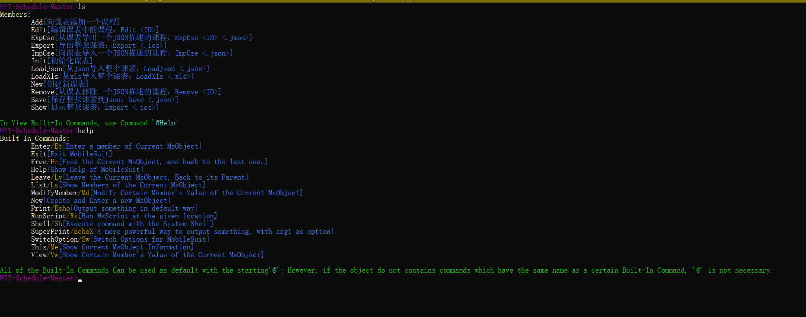

# MobileSuit

MobileSuit provides an easy way to quickly build a .NET Console App.

Focus on writing the backend part, Import PlasticMetal.MobileSuit, and simply write a Frontend in a very simple standard, then a beautiful Console App is born.

For Example: HIT-Schedule-Master CLI 

[View at Nuget.org](https://www.nuget.org/packages/PlasticMetal.MobileSuit/)

[View English Documents](https://ferdinandsukhoi.github.io/docs/en-US/MobileSuit/) in my Blog

在我的博客[查看中文文档](https://ferdinandsukhoi.github.io/docs/zh-CN/MobileSuit/)