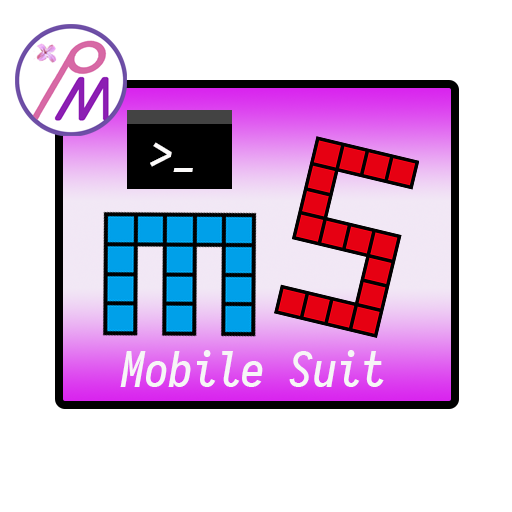

    

# MobileSuit

 

[View at Nuget.org](https://www.nuget.org/packages/PlasticMetal.MobileSuit/)

MobileSuit provides an easy way to quickly build a .NET Console App.

Focus on writing the backend part, Import PlasticMetal.MobileSuit, and simply write a Frontend in a very simple standard, then a beautiful Console App is born.

For Example: HIT-Schedule-Master CLI 

with PowerLine theme & I18N support

[View English Documentation](https://plastic-metal.github.io/en-US/MobileSuit/index.html)

[查看中文文档](https://plastic-metal.github.io/zh-CN/MobileSuit/index.html)
